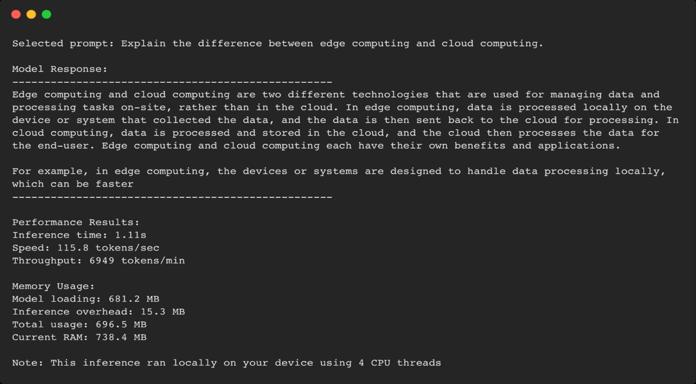

# Get Started with Edge AI

Learn Edge AI by running real examples on your machine. Instead of reading theory, we'll see how model size affects speed, memory, and accuracy.

## Setup

## Clone the Repository

```bash
git clone https://github.com/Arm-Examples/Get-Started-with-Edge-AI.git
cd Get-Started-with-Edge-AI
```

Create and activate a virtual environment:

```bash
python -m venv edge-ai-env
source edge-ai-env/bin/activate  # On Windows: edge-ai-env\Scripts\activate
```

Each example has its own `requirements.txt` - install dependencies with `pip install -r requirements.txt` in each example folder.

## Quick Examples - Get Started in a few Minutes

Follow the README for each example:

**[Object Detection](example_1_yolo_object_detection/)** - Compare two YOLO models in real-time video processing.


**Requirements:**

• Laptop or computer

• Camera (built-in webcam or USB camera)


**[Language Model with TinyLlama](example_2_tinyllama/)** - Test a chat model with different quantisation levels.



**Requirements:**

• Laptop or computer

---

### 🚀 **Coming Soon:** 
The examples are being worked on so they can easily be deployed on a Raspberry Pi, stay tuned!

