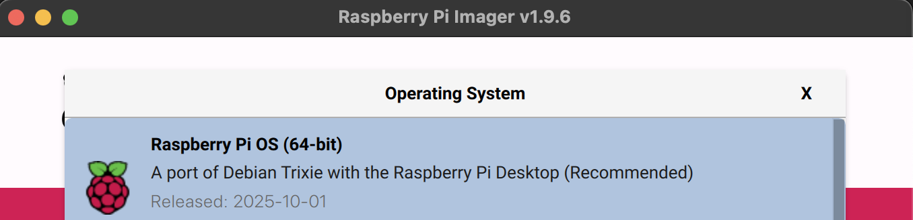

# Object Detection using Ultralytics YOLO11

Real-time object detection demonstrating Edge AI concepts: model size trade-offs, performance constraints, and local inference.

This demo uses [Ultralytics](https://ultralytics.com/) YOLO11 model. Ultralytics is a world leader in creating state-of-the-art computer vision tools for AI applications. Their YOLO (You Only Look Once) models set the standard for real-time object detection, balancing speed and accuracy at every scale.

## 🎬 Demo


---

### 💻 Hardware Requirements
### Development Machine
- **Laptop/Computer**: MacOS, Linux, or Windows
- **Camera**: Built-in webcam or USB camera
- **RAM**: 4GB minimum (8GB recommended)

### Raspberry Pi Deployment (Same Code, No Changes!)
- **Board**: Raspberry Pi 4 or 5 (4GB+ RAM recommended)
- **OS**: Raspberry Pi OS (64-bit, Full Desktop)
  
  
  
- **Camera**: Pi Camera Module 2/3 or USB webcam
- **Storage**: 16GB+ microSD card

---

### 🚀 Quick Start (3 Steps)

### 1. Install Dependencies


**Only execute on Raspberry Pi:**
```bash
sudo apt update
sudo apt install -y python3-pip python3-venv python3-opencv libcap-dev
```
**For all (including RPi):**
```bash
# Create virtual environment (recommended)
python -m venv edge-ai-env
source edge-ai-env/bin/activate  # Windows: edge-ai-env\Scripts\activate
```
For MacOS, Linux, Windows:
```bash
# Install requirements
pip install -r requirements.txt
```
For RPi:
```bash
pip install -r requirements_pi.txt
```

### 2. Launch the App
```bash
streamlit run YOLO11_Example.py
```

### 3. Start Experimenting!
Your browser will open automatically at `http://localhost:8501`. Start detecting objects, segmenting scenes, or tracking poses immediately!

---

### 🎯 How to Use the App

### Choose Your Input Source
- **📹 Video File**: Upload MP4/AVI files to analyze pre-recorded footage
- **📷 Camera**: Live feed from your webcam (desktop) or Pi Camera (Raspberry Pi)

### Select a Vision Task

| Task | What It Does | Use Cases |
|------|-------------|-----------|
| **Detection** | Draws boxes around objects | Security, counting, tracking |
| **Segmentation** | Precise pixel-level masks | Scene understanding, robotics |
| **Pose Estimation** | Detects human body keypoints | Fitness, sports analysis, HCI |

### Pick Your Model Size

The app automatically detects your platform and shows appropriate options:

**Nano**
- ⚡ Fastest inference
- 💾 Lowest memory usage
- ✅ Best for: Real-time on Raspberry Pi, battery devices
- 📊 Accuracy: Good for most applications

**Small**
- ⚖️ Balanced performance
- ✅ Best for: General purpose edge deployment
- 📊 Accuracy: Better than nano, still efficient

**Medium**
- 🎯 Higher accuracy
- 💪 More processing power needed
- ✅ Best for: Desktop testing, when accuracy matters most
- 📊 Accuracy: Excellent detection quality

### Monitor Performance
Real-time metrics show you:
- **Overall FPS**: AI model speed + Streamlit UI overhead
- **Inference FPS**: Pure AI model speed
- **Inference Time**: Milliseconds per frame

---

### 🎓 Learning Objectives

### 1. Edge AI Fundamentals
- **Local Processing**: All AI runs on your device—no cloud needed
- **Privacy**: Video never leaves your machine
- **Latency**: Instant responses vs. cloud round-trips
- **Reliability**: Works offline, no internet dependency

### 2. Performance Constraints
- See how model size impacts speed in real-time
- Understand FPS requirements for different applications
- Learn when "smaller and faster" beats "larger and more accurate"

### 3. Vision AI Capabilities
- Experiment with detection, segmentation, and pose estimation
- Understand which task fits which application
- See how task complexity affects performance

### 4. Deployment Workflow
- Test rapidly on development machine
- Deploy seamlessly to edge hardware
- Monitor performance metrics in production
---

### 🛠️ Technical Details

**Auto-Platform Detection**: The app detects if it's running on Raspberry Pi and automatically:

**Model Auto-Download**: First time you select a model, it downloads automatically. Subsequent runs use cached models.
