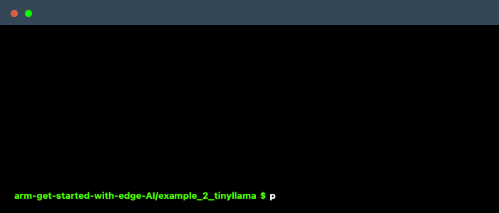

# TinyLlama Quantization - Edge AI Demo

Real-time language model inference demonstrating Edge AI concepts: quantization trade-offs, performance constraints, and local processing.



## Key Concept: Quantization in Edge AI

Quantization reduces model precision to make AI models smaller and faster, essential for edge deployment. This demo runs on your laptop for development and testing, simulating what will happen when deployed to edge devices like Raspberry Pi.

**Development Workflow**: The same code can run on arm-based edge devices using containers or direct deployment - we're testing locally first to understand performance characteristics before actual edge deployment.

*Note: Full device deployment examples will be covered in future updates to this repository.*

**Two quantization levels to compare:**

| Model | Size | Speed | Quality | Resource Usage |
|-------|------|-------|---------|----------------|
| **Q8_0** | ~1.17GB | Moderate | Higher | More CPU/RAM |
| **Q4_K_M** | ~669MB | Fastest | Good | Less CPU/RAM |

*Other quantization levels (Q2_K, Q5_K_M, Q6_K) exist but we focus on these two to demonstrate the core quantization trade-off.*

**Performance metrics displayed:**

- **Inference time**: Processing speed per token generation
- **Tokens/second**: Language generation capability
- **RAM usage**: Memory consumption

## Quick Start

1. Install dependencies:

   ```bash
   # For macOS with Apple Silicon (recommended)
   CMAKE_ARGS="-DLLAMA_METAL=on" pip install -r requirements.txt
   
   # For other platforms
   pip install -r requirements.txt
   ```

2. Download models:

   ```bash
   python download_models.py
   ```

   **What this does:**
   - Downloads pre-quantized TinyLlama models from Hugging Face
   - Source: [TheBloke/TinyLlama-1.1B-Chat-v1.0-GGUF](https://huggingface.co/TheBloke/TinyLlama-1.1B-Chat-v1.0-GGUF)
   - Gets both Q4_K_M (669MB) and Q8_0 (1.17GB) variants
   - Saves models to `models/` directory
   - Uses GGUF format optimized for llama.cpp inference

   **About the models:**
   - **Base model**: TinyLlama-1.1B-Chat fine-tuned for conversations
   - **Quantized by**: TheBloke (community expert in model quantization)
   - **Format**: GGUF (optimized for CPU and Metal GPU inference)
   - **License**: Apache 2.0 (free for commercial use)

3. **Test 8-bit model first** (higher quality, more resources):

   ```bash
   python tinyllama_benchmark.py --model Q8_0
   ```

   **Observe the performance metrics** - note your inference time, tokens/sec, and RAM usage. This represents 8-bit quantization with better quality but higher resource requirements.

4. **Switch to 4-bit model** (faster processing, fewer resources):

   ```bash
   python tinyllama_benchmark.py --model Q4_K_M
   ```

   **Compare the metrics** - you should see faster inference times, higher tokens/sec, and lower RAM usage compared to the 8-bit model. The exact numbers will vary based on your machine, but the performance improvement trend will be consistent.

5. **Key observations to make**:
   - How much faster is inference with 4-bit vs. 8-bit quantization?
   - What's the tokens/second difference between the models?
   - How much less RAM does the 4-bit model use?
   - Is there a noticeable difference in response quality?

Press Ctrl+C to quit each test.

## Learning Objectives

By testing and comparing these models, you'll understand:

### Quantization Concepts

- **8-bit quantization (Q8_0)**: Higher precision, better quality, more memory usage
- **4-bit quantization (Q4_K_M)**: Lower precision, faster inference, less memory usage
- **Trade-off analysis**: How reducing bit precision affects model size, speed, and quality

This hands-on comparison gives you the intuition needed to make quantization decisions for your own Edge AI projects.

## Advanced Usage

### Custom Prompts

Edit `prompts.txt` to add your own questions. Each line should contain one complete question.

### Performance Tuning

```bash
# Use more CPU threads for faster inference
python tinyllama_benchmark.py --model Q4_K_M --threads 8

# Generate longer responses
python tinyllama_benchmark.py --model Q8_0 --tokens 128

# Custom prompt
python tinyllama_benchmark.py --model Q4_K_M --prompt "Explain edge computing in simple terms"
```

### Command Line Options

- `--model`: Model variant (Q4_K_M, Q8_0)
- `--threads`: Number of CPU threads (default: 4)
- `--ctx`: Context window size (default: 512)
- `--tokens`: Number of tokens to generate (default: 128)
